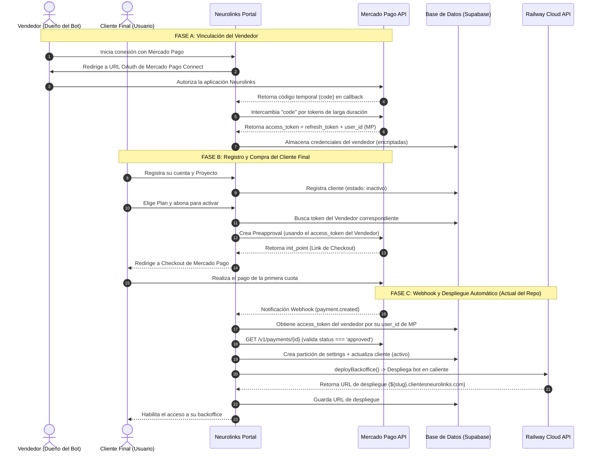

# Brief de Implementación: Suscripciones y OAuth con Despliegue Automatizado (Railway)

Este documento sirve como hoja de ruta técnica para migrar el flujo actual de cobros de **Neurolinks** hacia un modelo **Multi-Inquilino (Multi-Tenant) con Suscripciones Recurrentes**, conservando intacto el potente flujo de despliegue automatizado en **Railway** que ya está operativo en el repositorio.

---

## 📌 1. Arquitectura del Flujo Unificado

El sistema integrará la vinculación de cuentas de Mercado Pago de diferentes vendedores (OAuth) con el cobro recurrente automático (Suscripciones) y la posterior instanciación del bot de WhatsApp en Railway.



---

## 💾 2. Diseño de Base de Datos (Supabase)

Para soportar múltiples vendedores y sus respectivos planes/suscripciones sin romper la tabla `clientes` actual, extenderemos el esquema de base de datos.

### Nuevas Tablas a Incorporar:

```sql
-- 1. Cuentas de Mercado Pago vinculadas por los vendedores
CREATE TABLE mp_vendedores (
    id UUID PRIMARY KEY DEFAULT gen_random_uuid(),
    user_id UUID NOT NULL REFERENCES auth.users(id) ON DELETE CASCADE,
    mp_user_id TEXT UNIQUE NOT NULL, -- ID numérico provisto por MP
    access_token TEXT NOT NULL,      -- Guardar encriptado en producción
    refresh_token TEXT NOT NULL,     -- Necesario para renovar cada 180 días
    expires_at TIMESTAMP WITH TIME ZONE NOT NULL,
    created_at TIMESTAMP WITH TIME ZONE DEFAULT timezone('utc'::text, now()) NOT NULL,
    updated_at TIMESTAMP WITH TIME ZONE DEFAULT timezone('utc'::text, now()) NOT NULL
);

-- 2. Planes de Suscripción Recurrentes creados por los vendedores
CREATE TABLE mp_planes (
    id UUID PRIMARY KEY DEFAULT gen_random_uuid(),
    vendedor_id UUID NOT NULL REFERENCES mp_vendedores(id) ON DELETE CASCADE,
    mp_plan_id TEXT UNIQUE NOT NULL, -- preapproval_plan_id de Mercado Pago
    nombre TEXT NOT NULL,
    monto NUMERIC(10, 2) NOT NULL,
    currency_id TEXT DEFAULT 'ARS' NOT NULL,
    init_point TEXT NOT NULL,        -- Link de checkout del plan
    created_at TIMESTAMP WITH TIME ZONE DEFAULT timezone('utc'::text, now()) NOT NULL
);

-- 3. Histórico de Pagos de Suscripciones (para reportes de ganancias)
CREATE TABLE mp_pagos_ingresos (
    id UUID PRIMARY KEY DEFAULT gen_random_uuid(),
    mp_payment_id TEXT UNIQUE NOT NULL,
    cliente_id UUID REFERENCES clientes(id) ON DELETE SET NULL,
    vendedor_id UUID NOT NULL REFERENCES mp_vendedores(id) ON DELETE CASCADE,
    monto NUMERIC(10, 2) NOT NULL,
    net_amount NUMERIC(10, 2),       -- Monto recibido restando comisiones de MP
    currency_id TEXT DEFAULT 'ARS' NOT NULL,
    status TEXT NOT NULL,            -- approved, rejected, pending
    fecha_aprobacion TIMESTAMP WITH TIME ZONE NOT NULL,
    created_at TIMESTAMP WITH TIME ZONE DEFAULT timezone('utc'::text, now()) NOT NULL
);
```

> [!NOTE]  
> La tabla existente `clientes` permanecerá casi intacta, sirviendo como el puente para el flujo post-pago, pero se le añadirá una llave foránea opcional `vendedor_id` para saber a qué vendedor pertenece el pago y la suscripción.

---

## 🛠️ 3. Plan de Cambios en la API de Next.js

Para completar la integración, modificaremos y agregaremos rutas clave en la carpeta `app/api`.

### ➕ A. [NUEVO] Endpoint de Callback OAuth
**Ruta:** `/app/api/oauth/callback/route.js`  
**Responsabilidad:** Captura el código temporal (`code`) que envía Mercado Pago cuando un vendedor vincula su cuenta, solicita los tokens definitivos, y los guarda en la base de datos.

```javascript
// Lógica principal simplificada
export async function GET(request) {
  const { searchParams } = new URL(request.url);
  const code = searchParams.get("code");
  const localUserId = searchParams.get("state"); // Mapeado al usuario logueado en Neurolinks

  // 1. POST a https://api.mercadopago.com/oauth/token
  // 2. Guardar en 'mp_vendedores': access_token, refresh_token, mp_user_id (user_id de la respuesta de MP)
  // 3. Redirigir al vendedor de vuelta a su panel con mensaje de éxito
}
```

### ⚙️ B. [MODIFICAR] Generación del Pago
**Ruta:** `/app/api/pago/crear/route.js`  
**Responsabilidad:** Cambiar de un pago directo (Preferencia) a la creación de una Suscripción Recurrente (`Preapproval`).

```diff
- import { MercadoPagoConfig, Preference } from "mercadopago";
+ // Llamada directa mediante fetch o SDK a /preapproval utilizando el access_token del vendedor

export async function POST() {
  // 1. Obtener usuario y su registro en 'clientes'
- // 2. Crear preferencia con MP_ACCESS_TOKEN único
+ // 2. Buscar en 'mp_vendedores' el token del vendedor asignado al cliente
+ // 3. Hacer POST a https://api.mercadopago.com/preapproval con:
+ //    - preapproval_plan_id (del plan recurrente creado por el vendedor)
+ //    - card_token_id / payer_email
+ //    - external_reference: cliente.id
+ //    - back_url del portal
}
```

### ⚙️ C. [MODIFICAR] Webhook de Mercado Pago (Conservando Despliegue en Railway)
**Ruta:** `/app/api/webhooks/mercadopago/route.js`  
**Responsabilidad:** Validar los cobros usando el token correspondiente al vendedor en lugar del token único global, y continuar con la creación del bot.

```diff
export async function POST(request) {
  const url  = new URL(request.url);
  const body = await request.json().catch(() => ({}));
  
  const topic     = url.searchParams.get("topic") ?? body?.type;
  const paymentId = url.searchParams.get("id")    ?? body?.data?.id;
+ const mpUserId  = body?.user_id; // ID de Mercado Pago del vendedor que recibió el dinero

  if (topic !== "payment" || !paymentId) return NextResponse.json({ ok: true });

+ // 1. Buscar en la DB las credenciales de este vendedor específico usando mpUserId
+ const { data: vendedor } = await supabase
+   .from("mp_vendedores")
+   .select("access_token")
+   .eq("mp_user_id", String(mpUserId))
+   .single();
+
+ const accessToken = vendedor?.access_token ?? process.env.MP_ACCESS_TOKEN;

- const mp          = new MercadoPagoConfig({ accessToken: process.env.MP_ACCESS_TOKEN });
+ const mp          = new MercadoPagoConfig({ accessToken });
  const paymentApi  = new Payment(mp);
  const paymentData = await paymentApi.get({ id: String(paymentId) });

  if (paymentData.status !== "approved") return NextResponse.json({ ok: true });

  // ----------------------------------------------------
  // EL FLUJO POST-PAGO SE CONSERVA IDÉNTICO:
  // ----------------------------------------------------
  const clienteId = paymentData.external_reference;
  
  // 1. Obtiene cliente y valida si ya está activo.
  // 2. Genera UUID de partición de settings.
  // 3. Clona configuraciones 'default' al nuevo project_id.
  // 4. Llama a deployBackoffice(...) para levantar el bot en Railway.
  // 5. Actualiza al cliente como activado en Supabase con su deployment_url.
}
```

---

## ⚠️ 4. Consideraciones Clave para el Autor del Repo

> [!IMPORTANT]  
> **Seguridad de los Tokens:** Los `access_token` y `refresh_token` de los vendedores otorgan control total sobre sus cobros. Es mandatorio encriptar estos campos al guardarlos en la tabla `mp_vendedores` y desencriptarlos únicamente en tiempo de ejecución en la API.

> [!TIP]  
> **Tópicos Adicionales en el Webhook:** Para un control de suscripciones 100% robusto a largo plazo, el webhook no solo debería reaccionar a pagos aprobados (`payment`), sino también a cancelaciones o pausas de suscripciones enviadas en el tópico `subscription_preapproval`.

> [!WARNING]  
> **Rate Limiting:** Guardar cada transacción confirmada en la tabla `mp_pagos_ingresos` (tal como lo hace el webhook actual en el flujo de Railway) es la mejor decisión para evitar consumir la cuota de la API de Mercado Pago al momento de renderizar gráficos o estadísticas de ventas en los paneles.
