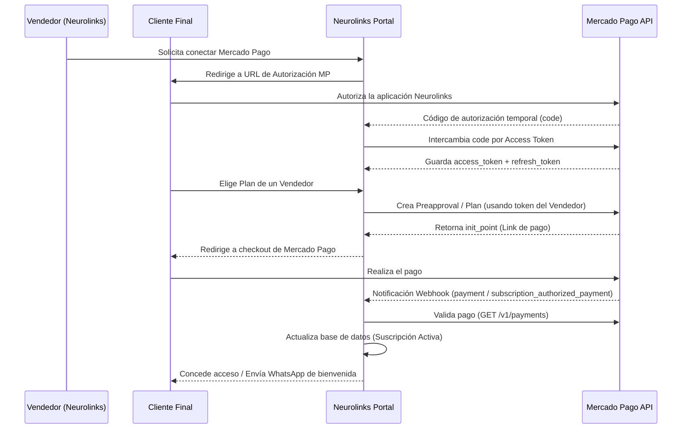

# Integración de Mercado Pago: Suscripciones y OAuth Multi-Cuenta

Este documento detalla la arquitectura, el modelo de datos y el flujo de implementación para integrar suscripciones multi-cuenta en el portal **Neurolinks**, permitiendo a diferentes vendedores conectar sus cuentas de Mercado Pago y gestionar cobros recurrentes de manera automatizada.

---

## 📌 Tabla de Contenidos
1. [Flujo de Arquitectura General](#1-flujo-de-arquitectura-general)
2. [Paso 1: Flujo de Conexión OAuth (Multi-Cuenta)](#2-paso-1-flujo-de-conexión-oauth-multi-cuenta)
3. [Paso 2: Creación de Planes y Selección de Links](#3-paso-2-creación-de-planes-y-selección-de-links)
4. [Paso 3: Sincronización en Tiempo Real con Webhooks](#4-paso-3-sincronización-en-tiempo-real-con-webhooks)
5. [Paso 4: Reporte de Ingresos y Control de Suscriptores](#5-paso-4-reporte-de-ingresos-y-control-de-suscriptores)
6. [Diseño de Base de Datos (SQL para Supabase)](#diseño-de-base-de-datos-sql-para-supabase)
7. [Ejemplo de Endpoint de Webhook (TypeScript / Node.js)](#ejemplo-de-endpoint-de-webhook-typescript--nodejs)

---

## 1. Flujo de Arquitectura General

El sistema actúa como un agregador/portal (multi-tenant). Cada vendedor vincula su propia cuenta de Mercado Pago a Neurolinks. A partir de allí, cuando un usuario final se suscribe, Neurolinks genera y selecciona el link de pago (`init_point`) correspondiente al vendedor elegido, procesa la acreditación por webhooks y concede acceso.



---

## 2. Paso 1: Flujo de Conexión OAuth (Multi-Cuenta)

Para actuar en representación de múltiples cuentas de Mercado Pago, debes usar **Mercado Pago Connect (OAuth)**.

### A. URL de redirección para autorizar
Redirige al vendedor a la página de inicio de sesión y autorización de Mercado Pago:

```url
https://auth.mercadopago.com/authorization?client_id=TU_APP_ID&response_type=code&platform_id=mp&state=VENDEDOR_LOCAL_ID&redirect_uri=https://tuportal.com/api/oauth/callback
```
* **`client_id`**: El ID de tu aplicación en el Developer Panel de Mercado Pago.
* **`state`**: El ID interno del vendedor en Neurolinks (sirve para mapear de quién es el token al recibir el callback).
* **`redirect_uri`**: Tu endpoint para procesar el callback (debe coincidir exactamente con el configurado en tu panel de desarrollador).

### B. Endpoint de Callback (Intercambio de Token)
Cuando el usuario acepta, es redirigido a `/api/oauth/callback?code=TG-XXXXXX&state=VENDEDOR_LOCAL_ID`. Tu servidor debe realizar este llamado HTTP inmediatamente:

```bash
POST https://api.mercadopago.com/oauth/token
Content-Type: application/json

{
  "client_id": "TU_APP_ID",
  "client_secret": "TU_CLIENT_SECRET",
  "code": "TG-XXXXXX",
  "grant_type": "authorization_code",
  "redirect_uri": "https://tuportal.com/api/oauth/callback"
}
```

**Respuesta exitosa de Mercado Pago:**
```json
{
  "access_token": "APP_USR-123456...",
  "token_type": "bearer",
  "expires_in": 15552000,
  "scope": "offline_access read write",
  "user_id": 987654321,
  "refresh_token": "TG-XXXX-XXXX"
}
```
> ⚠️ **IMPORTANTE:** Guarda el `access_token` y el `refresh_token` de manera encriptada en tu base de datos.
> El token expira en 180 días (`expires_in` = 15,552,000 segundos). Debes renovarlo automáticamente antes de ese plazo usando el `refresh_token`.

### C. Renovación de Access Token
```bash
POST https://api.mercadopago.com/oauth/token
Content-Type: application/json

{
  "client_id": "TU_APP_ID",
  "client_secret": "TU_CLIENT_SECRET",
  "grant_type": "refresh_token",
  "refresh_token": "EL_REFRESH_TOKEN_GUARDADO"
}
```

---

## 3. Paso 2: Creación de Planes y Selección de Links

Una vez tengas el `access_token` del vendedor específico, puedes crear planes y suscripciones usando su token en el header `Authorization`.

### A. Crear Plan de Suscripción (`/preapproval_plan`)
```bash
POST https://api.mercadopago.com/preapproval_plan
Authorization: Bearer <SELLER_ACCESS_TOKEN>
Content-Type: application/json

{
  "reason": "Suscripción Neurolinks Premium",
  "auto_recurring": {
    "frequency": 1,
    "frequency_type": "months",
    "transaction_amount": 2500,
    "currency_id": "ARS"
  },
  "back_url": "https://neurolinks.com/dashboard/success"
}
```

**Respuesta recibida:**
```json
{
  "id": "2c938084726fca480172750000000000",
  "reason": "Suscripción Neurolinks Premium",
  "init_point": "https://www.mercadopago.com.ar/subscriptions/checkout?preapproval_plan_id=2c938084726fca480172750000000000",
  "status": "active"
}
```

* Guarda el campo `init_point` en tu base de datos asociado al plan y al vendedor.
* Cuando el cliente final quiera suscribirse, simplemente lo redireccionas (usando `<a href="init_point">`) o abres la URL en su navegador/bot.

---

## 4. Paso 3: Sincronización en Tiempo Real con Webhooks

Los webhooks te permiten reaccionar a eventos de pagos y suscripciones en tiempo real pasivamente.

En el **Panel de Desarrollador de Mercado Pago**, configura una URL de Webhooks de producción (ej. `https://tuportal.com/api/webhooks/mercadopago`) y activa los siguientes tópicos:
1. `payment` (Cobros directos y cuotas de suscripciones)
2. `subscription_authorized_payment` (Acreditaciones específicas de cuotas de suscripciones)
3. `subscription_preapproval` (Alta, pausa o cancelación de la firma de suscripción)

### Formato de notificación recibida (POST):
```json
{
  "action": "payment.created",
  "api_version": "v1",
  "data": {
    "id": "9988776655"
  },
  "date_created": "2026-05-29T18:00:00Z",
  "id": 123456789,
  "live_mode": true,
  "type": "payment",
  "user_id": "987654321"
}
```

### Proceso del servidor ante una notificación:
1. Lee `type` y `data.id`.
2. Realiza un `GET` a la API correspondiente usando el token del vendedor afectado (`user_id` de la notificación):
   `GET https://api.mercadopago.com/v1/payments/9988776655`
3. Si el estado (`status`) devuelto es `approved`:
   - Identifica al usuario final a través del metadato `external_reference` o el `payer.email`.
   - Modifica el estado del usuario en la base de datos a `activo`.
   - Dispara redirecciones en tu web o notificaciones por WhatsApp/Email.

---

## 5. Paso 4: Reporte de Ingresos y Control de Suscriptores

### A. Cantidad de Suscriptores por Cuenta
Puedes calcular la cantidad de suscriptores realizando una búsqueda de las suscripciones asociadas a los planes de cada vendedor:

```bash
GET https://api.mercadopago.com/preapproval/search?status=authorized&limit=50
Authorization: Bearer <SELLER_ACCESS_TOKEN>
```
La respuesta incluye un bloque de paginación con el total de suscriptores activos:
```json
{
  "paging": {
    "total": 142,
    "limit": 50,
    "offset": 0
  },
  "results": [...]
}
```

### B. Control de Ingresos
Para calcular las ganancias y control de ingresos de cada cuenta de manera dinámica e histórica:

```bash
GET https://api.mercadopago.com/v1/payments/search?status=approved&begin_date=NOW-30DAYS&end_date=NOW
Authorization: Bearer <SELLER_ACCESS_TOKEN>
```
Este endpoint te devuelve los pagos aprobados dentro de un periodo. Puedes sumar los valores de `transaction_amount` para obtener el ingreso total bruto.
> 💡 **RECOMENDACIÓN:** Para evitar límites de tasa (rate limiting) de Mercado Pago, almacena cada pago aprobado recibido vía Webhook en tu tabla local `ingresos_pagos`. Esto te permitirá calcular ingresos diarios, mensuales o anuales instantáneamente mediante consultas SQL locales.

---

## Diseño de Base de Datos (SQL para Supabase)

Puedes ejecutar esta migración directamente en Supabase para preparar tu base de datos multi-inquilino.

```sql
-- 1. Tabla de Vendedores (Cuentas conectadas de Mercado Pago)
CREATE TABLE mp_vendedores (
    id UUID PRIMARY KEY DEFAULT gen_random_uuid(),
    user_id UUID NOT NULL REFERENCES auth.users(id) ON DELETE CASCADE,
    mp_user_id TEXT UNIQUE NOT NULL,
    access_token TEXT NOT NULL,
    refresh_token TEXT NOT NULL,
    expires_at TIMESTAMP WITH TIME ZONE NOT NULL,
    created_at TIMESTAMP WITH TIME ZONE DEFAULT timezone('utc'::text, now()) NOT NULL,
    updated_at TIMESTAMP WITH TIME ZONE DEFAULT timezone('utc'::text, now()) NOT NULL
);

-- 2. Tabla de Planes de Suscripción creados por los vendedores
CREATE TABLE mp_planes (
    id UUID PRIMARY KEY DEFAULT gen_random_uuid(),
    vendedor_id UUID NOT NULL REFERENCES mp_vendedores(id) ON DELETE CASCADE,
    mp_plan_id TEXT UNIQUE NOT NULL, -- preapproval_plan_id
    nombre TEXT NOT NULL,
    monto NUMERIC(10, 2) NOT NULL,
    currency_id TEXT DEFAULT 'ARS' NOT NULL,
    init_point TEXT NOT NULL, -- Checkout Link
    created_at TIMESTAMP WITH TIME ZONE DEFAULT timezone('utc'::text, now()) NOT NULL
);

-- 3. Tabla de Suscripciones Activas de los clientes
CREATE TABLE mp_suscripciones (
    id UUID PRIMARY KEY DEFAULT gen_random_uuid(),
    mp_preapproval_id TEXT UNIQUE NOT NULL,
    cliente_id UUID NOT NULL, -- ID del usuario final en tu base de datos
    plan_id UUID NOT NULL REFERENCES mp_planes(id) ON DELETE CASCADE,
    vendedor_id UUID NOT NULL REFERENCES mp_vendedores(id) ON DELETE CASCADE,
    status TEXT NOT NULL, -- authorized, paused, canceled, pending
    valid_until TIMESTAMP WITH TIME ZONE,
    created_at TIMESTAMP WITH TIME ZONE DEFAULT timezone('utc'::text, now()) NOT NULL,
    updated_at TIMESTAMP WITH TIME ZONE DEFAULT timezone('utc'::text, now()) NOT NULL
);

-- 4. Tabla de Ingresos / Registro de Pagos
CREATE TABLE mp_pagos_ingresos (
    id UUID PRIMARY KEY DEFAULT gen_random_uuid(),
    mp_payment_id TEXT UNIQUE NOT NULL,
    suscripcion_id UUID REFERENCES mp_suscripciones(id) ON DELETE SET NULL,
    vendedor_id UUID NOT NULL REFERENCES mp_vendedores(id) ON DELETE CASCADE,
    monto NUMERIC(10, 2) NOT NULL,
    net_amount NUMERIC(10, 2), -- Monto neto recibido tras comisiones
    currency_id TEXT DEFAULT 'ARS' NOT NULL,
    status TEXT NOT NULL, -- approved, rejected, in_process
    fecha_aprobacion TIMESTAMP WITH TIME ZONE NOT NULL,
    created_at TIMESTAMP WITH TIME ZONE DEFAULT timezone('utc'::text, now()) NOT NULL
);

-- Índices de búsqueda para agilizar consultas
CREATE INDEX idx_mp_planes_vendedor ON mp_planes(vendedor_id);
CREATE INDEX idx_mp_suscripciones_cliente ON mp_suscripciones(cliente_id);
CREATE INDEX idx_mp_suscripciones_status ON mp_suscripciones(status);
CREATE INDEX idx_mp_pagos_vendedor_fecha ON mp_pagos_ingresos(vendedor_id, fecha_aprobacion);
```

---

## Ejemplo de Endpoint de Webhook (TypeScript / Node.js)

```typescript
import { Request, Response } from 'express';
import axios from 'axios';

interface WebhookBody {
  action: string;
  type: string;
  data: {
    id: string;
  };
  user_id: string; // ID del vendedor en Mercado Pago
}

export async function mercadopagoWebhookHandler(req: Request, res: Response) {
  const { type, data, user_id } = req.body as WebhookBody;

  // Responder 200 inmediatamente a Mercado Pago para evitar reintentos duplicados
  res.status(200).send('OK');

  try {
    if (type === 'payment') {
      const paymentId = data.id;

      // 1. Buscar en tu base de datos las credenciales del vendedor usando el user_id (MP)
      const vendedor = await db.query('SELECT access_token FROM mp_vendedores WHERE mp_user_id = $1', [user_id]);
      if (!vendedor) {
        console.error(`Vendedor no registrado para el ID de MP: ${user_id}`);
        return;
      }
      
      const accessToken = vendedor.access_token;

      // 2. Consultar detalles del pago a la API de Mercado Pago
      const response = await axios.get(`https://api.mercadopago.com/v1/payments/${paymentId}`, {
        headers: {
          Authorization: `Bearer ${accessToken}`
        }
      });

      const paymentData = response.data;

      // 3. Procesar si el pago es aprobado
      if (paymentData.status === 'approved') {
        const externalReference = paymentData.external_reference; // Aquí debes asociar el ID del cliente final
        const amount = paymentData.transaction_amount;
        const netAmount = paymentData.transaction_details.net_received_amount;

        // Actualizar la suscripción local
        await db.query(
          `UPDATE mp_suscripciones 
           SET status = 'authorized', valid_until = NOW() + INTERVAL '1 month', updated_at = NOW() 
           WHERE cliente_id = $1`, 
          [externalReference]
        );

        // Guardar el registro del cobro para el control de ingresos
        await db.query(
          `INSERT INTO mp_pagos_ingresos (mp_payment_id, vendedor_id, monto, net_amount, status, fecha_aprobacion) 
           VALUES ($1, (SELECT id FROM mp_vendedores WHERE mp_user_id = $2), $3, $4, 'approved', $5)`,
          [paymentId, user_id, amount, netAmount, paymentData.date_approved]
        );

        console.log(`Acceso concedido exitosamente para el cliente: ${externalReference}`);
      }
    }
  } catch (error) {
    console.error('Error al procesar notificación de Mercado Pago:', error);
  }
}
```
